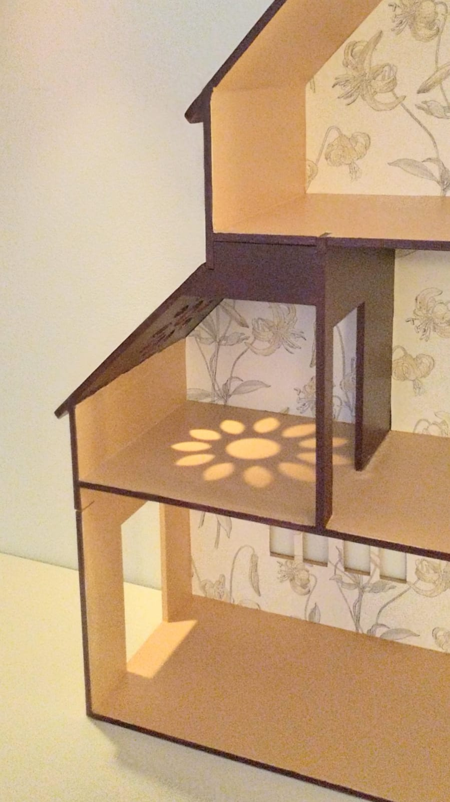

# Dollhouse

Author: Tuomas Lukka (tjltjl)

Material: 6mm plywood

Tools: Fusion 360

The project that launched plycutter. 

The original CAD model:

Laser-cut and glued:

Painted and with wallpaper:

