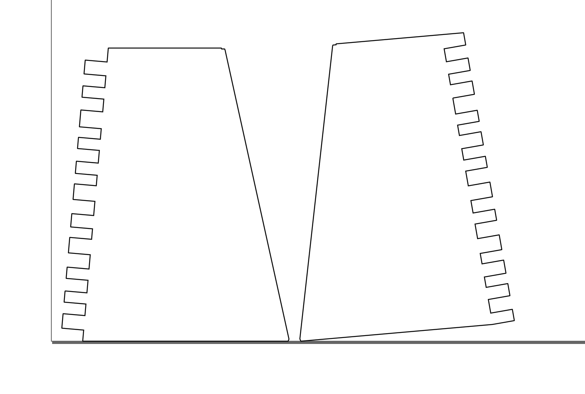

# Plycutter - STL to finger-jointed DXF slicer

Author: Tuomas Lukka, tuomas@hipcode.fi

[Official homepage](https://tjltjl.github.io/plycutter)

[Github repo](https://github.com/tjltjl/plycutter)

[Introductory blog post with lots of pictures](https://hipcode.fi/?p=25324)

## Introduction

Plycutter is a program that takes a 3D model in an `.stl` file and
generates 2D `.dxf` files suitable for laser cutting, with generated
finger joints between material sheets where appropriate.

The 3D needs to
be designed in a way where the sheets are clearly visible
(e.g., using the CAD program's 'shell' command).

Example (images on the right): pen holder consisting of two stacked octahedra
(scale model from 3mm plywood).

* Top: CAD model. The CAD model was designed as two
  octahedra on top of each other and the 'shell' command
  in the CAD program (Fusion 360) was used to produce
  the shape consisting of sheets. A further cut on the top
  was made to create the curved edges.
  This model was then exported as a `.stl`

* Middle:
  Result of running plycutter on the `.stl` file
  to produce `.dxf` file for laser cutter.

* Bottom: the laser-cut plywood parts assembled.
  In cases where the vertical cuts from the laser cutter
  cannod exactly follow the model (such as the tips of the top
  triangle or the non-90-degree joints),
  plycutter tries to retain as much material as possible
  so that a quick sanding or filing operation will get
  the desired shape.

  For non-90-degree joints, some gaps are unavoidable but
  a multitools and wood filler make quick work of those.

For more showcase images, see [Plycutter summary PDF](./Plycutter summary 2022-11-25.pdf)

**Note** Plycutter is alpha-stage software and probably contains
many bugs. Please report any bugs as issues in the github project,
preferably with a pull request with a failing test,
or at least a minimal .stl file and command line for reproducing
the problem.

## Purpose / use cases

Plycutter is at its best for making one-off prototypes
or small production runs, or for generative objects
where each object is custom-generated from user input.

Unlike with 3D printers, the workspace is much larger
(depending on the laser cutter used; with a little planning,
it is also possible to make much larger objects than your
laser cutter - only each sheet must fit).

The author has personally used it to iterate on some household
object concepts, where it provides a fast and robust way
(compared to 3D printing, for example) of iterating
large objects.

Currently, the program generates the fingers somewhat randomly
which makes it next to impossible to assemble the objects
wrong and also makes them into interesting puzzles.

## Installing plycutter

On a recent ubuntu, you can do the following.

        sudo apt-get install libgeos-c1v5 libmpc-dev libspatialindex-dev
        python -m pip install --upgrade pip
        python -m pip install flake8 pytest
        if [ -f requirements.txt ]; then pip install -r requirements.txt; fi

This is copied from the github test action so it should work
ok.

On MacOS, the author uses conda to install the dependencies, see ``environment.yml``.

## Basic usage; Getting started

Install plycutter. Run the tests (pytest) to ensure all dependencies work.

Next, run the input file `PlyTest0.1.stl` which contains a very
simple object consisting of two sheets that meet at a corner.

We run plycutter from the command line using the following command:

        plycutter -o foo.dxf --thickness 6 ./tests/data/PlyTest0.1.stl

which produces the output `foo.dxf`. You can open it in, e.g., Inkscape.
The following image shows the contents of such a file;
the lines on the left and on the bottom are Inkscape's paper edge.

Now it is possible to run this file in a laser cutter to obtain
two pieces of e.g. plywood or acrylic that
fit each other perfectly.

## `plycutter` Command line options

        usage: plycutter [-h] [--thickness THICKNESS]
                         [--min_finger_width MIN_FINGER_WIDTH]
                         [--max_finger_width MAX_FINGER_WIDTH]
                         [--support_radius SUPPORT_RADIUS] [--debug]
                         [--final_dilation FINAL_DILATION] [--random_seed RANDOM_SEED]
                         [--only_sheets ONLY_SHEETS] [-o OUTPUT_FILE]
                         infile

        positional arguments:
          infile                STL file to process

        optional arguments:
          -h, --help            show this help message and exit
          --thickness THICKNESS
                                Set the thickness of sheets to find. (default: 6)
          --min_finger_width MIN_FINGER_WIDTH
                                Set minimum width for generated fingers. (default: 3)
          --max_finger_width MAX_FINGER_WIDTH
                                Set maximum width for generated fingers. (default: 5)
          --support_radius SUPPORT_RADIUS
                                Set maximum range for generating material on a sheet
                                where neither surface is visible (default: 12)
          --debug               Turn on debugging. (default: False)
          --final_dilation FINAL_DILATION
                                Final dilation (laser cutter kerf compensation)
                                (default: 1/20)
          --random_seed RANDOM_SEED
                                Random seed for pseudo-random heuristics (default: 42)
          --only_sheets ONLY_SHEETS
                                Not implemented yet (default: None)
          -o OUTPUT_FILE, --output_file OUTPUT_FILE
                                File to write the DXF output in (default: None)

## The most relevant known limitations

Plycutter is a hobby project, published in hope that it will be
useful.  Currently, the author (Tuomas Lukka) is in freelancer mode
so feel free to contact the author to offer a consulting gig if
there is a particular limitation you would like to see get worked
on ASAP (or for other projects :) ).

* For large models and models with many curves, plycutter is
  currently relatively slow.
  Even for small models, getting some speedup would be
  very welcome.
  The slowness is due to the exact 2D library that was written
  as a quick replacement to a commonly used
  off-the-shelf Python 2D library when it turned
  out that rounding errors from floats
  made it impossible to use
  in this work (the joint fingers are generated along linees
  and getting rounding errors that flip vertices'
  area were causing assertion failures).
  There are several badly scaling algorithms in plycutter's
  own 2D geometry library and those
  algorithms need to be replaced with faster
  ones.
  The ideal solutioin would be to replace the 2D library
  wth an external one that
  can do exact, rational geometry fast, but so far,
  I have not had success with this.
  The `Geom2D` API has been kept simple for this reason.

* Shallow joints (between 135 and 180 degrees)
  are currently handled badly, with finger lengths becoming
  extreme.
  The system should understand when it does not make sense
  to make the fingers longer.

* Long joints where more than 2 sheets meet are handled very
  rudimentarily and can produce unexpected results.
  Writing an algorithm that does better is fairly
  straightforward but hasn't been done yet.
  The function that makes the simplistic decisions is
  `heuristic_multi_inter_single_decisions`
  in `plycutter/heuristics.py`. 

* For two sheets that cross each other in an "X" shape,
  plycutter will currently produce output that would only
  be assemblable in 4D. I.e. it will produce holes on both
  sheets that would fit together if it were possible
  to assemble the sheets. The real solution here is to allow
  plycutter to cut one of the sheets into parts but doing
  that correctly requires...

* ...buildability analysis. It is possible to make 2D patterns
  that cannot be assembled. For example, the two interlocking
  cubes example could have produced such a pattern but luckily
  did not.

* Curved sheets are not yet supported (curved sheet **edges**
  work fine; of course they get subdivided into
  lines in the STL export).
  The architecture is should be fairly easy
  to extend in that direction:
  the `Sheet`, `Inter` and `InterSide` objects are designed
  in a way that may make this easy.
  Representing the `InterSide` as a subdivided polygonal
  curve is probably the easiest approach to integrate
  with the current `Geom2D` code.
  Naturally, the curved sheets should only be [developable
  surfaces(Wikipedia)](https://en.wikipedia.org/wiki/Developable_surface)

* Currently, plycutter is not able to make use of the capabilities
  of 5-axis laser or water cutters or mills,
  mostly because the author has no access to such machines.
  If you are able to arrange such access, please get in touch.
  The biggest plus of 5 axes is that in non-90-degree joints,
  there will be no gaps or protruding parts.
  However, it gets better: 5 axes will enable a wide
  variety of joint shapes.

* Milling or water cutting may require dog bone corners which
  are also not implemented for the above reason.

* The joint pieces that belong together are not marked in any way
  currently. Adding a laser-carved number would be a great way
  to help the assembly process when there are many parts
  (for example, the dollhouse stairs were quite an interesting
  task to assemble...)

