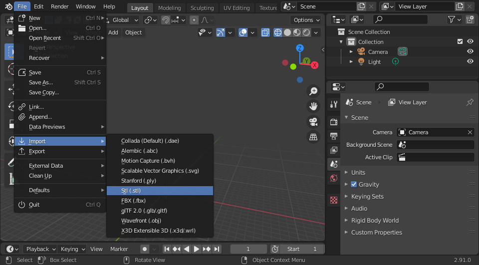

# Converting solid objects to hollow

This tutorial demonstrates how to take a solid object designed for 3D printing
and make it a hollow object, suitable for use with plycutter.

For this tutorial we're going to use the [low-poly standford
bunny](https://www.thingiverse.com/thing:151081) available from thingiverse.
Generally low-poly objects are best, since each poly is going to end up being a
cut.

To start you'll be presented with a window like this:

After importing your STL model you'll be presented with a basic view.

Blender is a model editor that relies on keyboard shortcuts a lot. You can press
"Z" to change your view mode to wireframe, and do make sure the editor is in
object mode.

From the side menu select the wrench option, we're going to add the "solidify"
modifier to our bunny

Finally, we want to set the thickness to "3 m" (for a 3mm offset) check the
"even thickness" box, and unset the fill option.

You can see at this point we have a distinct inside and outside, in the style
required by plycutter.

